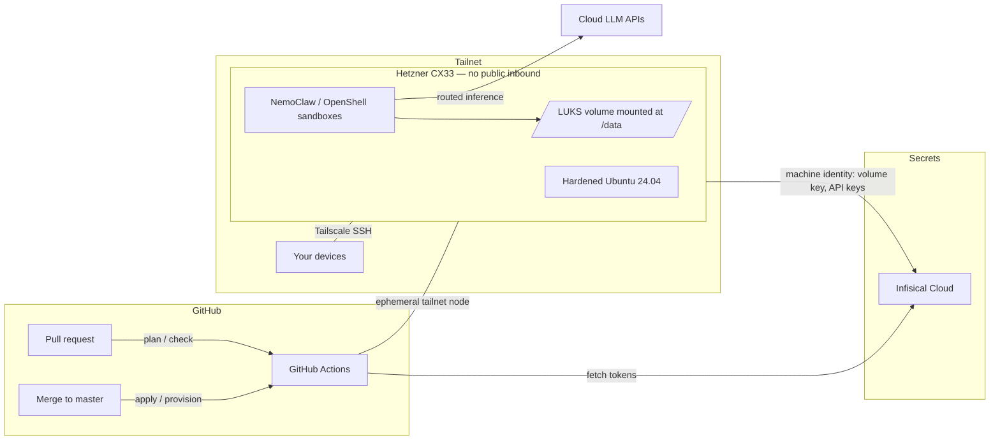

# Secure AI Workflow Server

Infrastructure-as-code for a single personal server that runs sandboxed AI agent
workflows. Everything about the server — infrastructure, provisioning,
secrets wiring, and the agent runtime — is defined in this repository.

## Stack

| Layer | Tool | Notes |
|-------|------|-------|
| Infrastructure | [Terraform](https://developer.hashicorp.com/terraform) + [hcloud provider](https://registry.terraform.io/providers/hetznercloud/hcloud) | Hetzner CX33 (4 vCPU / 8 GB / 80 GB), state in HCP Terraform (state-only) |
| Provisioning | [Ansible](https://docs.ansible.com/) | Hardening, Tailscale, Infisical, LUKS volume, NemoClaw |
| Access | [Tailscale](https://tailscale.com/) | Fully dark host: **zero** public inbound ports |
| Secrets | [Infisical Cloud](https://infisical.com/) | Source of truth for all credentials |
| Agent runtime | [NVIDIA NemoClaw](https://github.com/NVIDIA/NemoClaw) | Agents in OpenShell sandboxes, routed inference |
| CI/CD | GitHub Actions | Terraform plan/apply and Ansible runs; runners join the tailnet |

## Architecture



Key properties:

- **True full-disk encryption.** The root filesystem is LUKS2 (custom image
  built by the `packer/` pipeline; unencrypted `/boot` only) and the data
  volume is LUKS2. At boot the initramfs joins the tailnet as an ephemeral
  `tag:boot-unlock` node and a launchd agent on your Mac (`macos/`) delivers
  the passphrase from 1Password automatically — reboots are hands-free
  while your Mac is awake, and the Hetzner console is the manual fallback.
- **Dark host.** The Hetzner Cloud Firewall drops all inbound traffic. SSH and
  every service are reachable only over the tailnet (Tailscale requires no
  inbound ports). Break-glass access is the Hetzner web console — see
  [docs/runbooks/break-glass.md](docs/runbooks/break-glass.md).
- **Secrets never live in this repo or in GitHub, except three bootstrap
  credentials.** GitHub repo secrets hold only the Infisical machine-identity
  credentials (client ID + secret) and the HCP Terraform token; workflows pull everything else
  (Hetzner token, Tailscale OAuth client, ntfy topic, LLM API keys) from
  Infisical at run time.
- **Key custody is split.** The data-volume key comes from Infisical (the
  server's own identity can read it); the root passphrase lives in a
  dedicated 1Password vault (service-account, read-only, that vault only)
  with a recovery copy under Infisical `/unlock` — a path the server
  identity can never read, so the server cannot unlock itself.
- **Agents are sandboxed.** NemoClaw runs each agent inside an OpenShell
  container with a blueprint controlling filesystem scope, network egress, and
  inference routing.

Full design rationale and the decision log live in
[docs/architecture.md](docs/architecture.md).

## Repository layout

```
terraform/            Hetzner infrastructure (server, firewall, volume, SSH key)
packer/               FDE image pipeline (LUKS2 root + tailnet-unlock initramfs)
ansible/              Provisioning: inventory, site.yml, roles/
macos/                Mac unlock agent (launchd + 1Password + ntfy)
.github/workflows/    terraform.yml, ansible.yml, packer.yml
docs/                 architecture.md, verification.md, runbooks/
```

## One-time bootstrap

These steps happen once, by hand, before CI can take over. Everything after
them is driven by pull requests.

1. **HCP Terraform** — create an organization and a workspace named
   `menegroth`. Set the workspace **execution mode to "Local"** (we use
   it only for state storage and locking; runs happen in GitHub Actions).
   Create a user/team API token.
2. **Infisical Cloud** (EU region — the workflows target `eu.infisical.com`) —
   create a project (e.g. `menegroth`) with a `prod` environment, then two
   [machine identities](https://infisical.com/docs/documentation/platform/identities/universal-auth).
   Identities are org-level objects: create each, give it Universal Auth (which
   yields a Client ID + Client Secret), then add it to the project with a role
   scoped to the paths below.
   - `ci` — read access to `/ci/*` **and `/unlock/*`** (holds `HCLOUD_TOKEN`,
     `TS_OAUTH_CLIENT_ID`, `TS_OAUTH_SECRET`, `ANSIBLE_BECOME_PASS` if used; the
     Packer image build also fetches `/unlock/*` as this identity — see step 6)
   - `server` — read access to `/server/*` only (holds `DATA_VOLUME_LUKS_KEY`,
     LLM API keys, `NTFY_TOPIC_URL`). It must **never** be granted `/unlock/*` —
     that is what stops the server from unlocking its own root.

   The `ci` Client ID/Secret go into GitHub repo secrets (step 4); the `server`
   Client ID/Secret go into Infisical at `/ci/SERVER_IDENTITY_CLIENT_ID` and
   `/ci/SERVER_IDENTITY_CLIENT_SECRET`, where the Ansible `infisical` role reads
   them and delivers them onto the host.
3. **Tailscale** — in the admin console (**Access controls** → the tailnet
   policy file editor):
   1. Paste the ACL policy from
      [docs/architecture.md](docs/architecture.md#tailscale-acls) — do this
      **first**, since you cannot mint a tagged key or OAuth client for a tag
      that has no `tagOwners` entry. Include `tag:boot-unlock` now (used in
      step 6) so the policy is edited only once.
   2. **OAuth client** (Settings → OAuth clients): create one with the
      `auth_keys` write scope, tagged `tag:ci`. Store its client ID/secret in
      Infisical at `/ci/TS_OAUTH_CLIENT_ID` and `/ci/TS_OAUTH_SECRET`. CI mints
      an ephemeral `tag:ci` key from this on every run.
   3. **Server auth key** (Settings → Keys → Generate auth key): **reusable**,
      **pre-authorized**, **NOT ephemeral** (the server is a persistent node),
      tagged `tag:server`. Store it in Infisical at `/ci/TS_SERVER_AUTHKEY` —
      the Ansible `tailscale` role reads it for the server's first join. After
      the server is up, disable key expiry on its node (Machines → server) so a
      set-and-forget box never drops off the tailnet.

   The `tag:boot-unlock` **key** itself (reusable, *ephemeral*, pre-authorized)
   is created in step 6 and stored under `/unlock/`, not here.
4. **GitHub repo secrets** — set exactly three:
   `TF_API_TOKEN` (HCP Terraform), `INFISICAL_CLIENT_ID`,
   `INFISICAL_CLIENT_SECRET` (the `ci` machine identity).
5. Generate an SSH keypair for Ansible bootstrap
   (`ssh-keygen -t ed25519 -C ai-server-admin`), store the private key in
   Infisical under `/ci/SSH_PRIVATE_KEY`, and put the public key in
   `terraform/variables.tf` (`admin_ssh_public_key`).
6. **FDE unlock prep** — create the `/unlock` Infisical path (readable by CI
   and you, **not** by the `server` identity): `ROOT_LUKS_KEY`
   (`openssl rand -base64 48`) and `TS_BOOT_AUTHKEY` (reusable + ephemeral +
   pre-authorized, restricted to `tag:boot-unlock`). Add the `tag:boot-unlock`
   ACLs (see `packer/README.md`). On your Mac: create the 1Password
   `AI-Server-Unlock` vault + scoped service account (`macos/README.md`),
   run `macos/install.sh`, and put the printed public key into
   `packer/fde-image.pkr.hcl`.
7. **Build the FDE image before the first Terraform apply**: run the
   "Packer FDE image" workflow (workflow_dispatch) and verify it per
   `packer/README.md` — Terraform selects the newest `fde=true` snapshot.

## Local development

```bash
pipx install pre-commit && pre-commit install   # or: pip install --user pre-commit
cd terraform && terraform fmt -recursive && terraform validate
cd ansible && ansible-lint
```

## Build phases

The repo was built incrementally; each phase is a self-contained commit that
leaves the system deployable:

0. Repo scaffolding (this README, docs, lint tooling)
1. Terraform foundation + CI (server reachable over temporary public SSH)
2. Ansible baseline hardening
3. Tailscale + go dark (all public inbound closed)
4. Infisical machine identity on the server
5. LUKS-encrypted data volume
6. NemoClaw agent runtime
7. Operations: backups, monitoring, runbooks
8. Packer pipeline for the FDE (LUKS2-root) server image
9. Server migrated to the FDE image
10. Mac unlock agent — automated remote unlock over Tailscale
11. Ops alignment: evening reboot window, stuck-at-boot alerting
12. Mac-side secrets moved from Apple Keychain to 1Password
