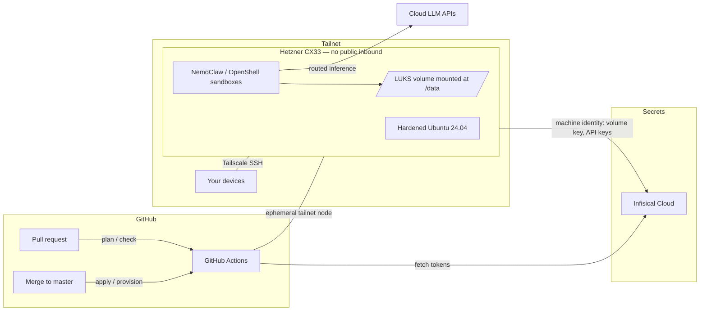

# Secure AI Workflow Server

Infrastructure-as-code for a single personal server that runs sandboxed AI agent
workflows. Everything about the server — infrastructure, provisioning,
secrets wiring, and the agent runtime — is defined in this repository.

## Stack

| Layer | Tool | Notes |
|-------|------|-------|
| Infrastructure | [Terraform](https://developer.hashicorp.com/terraform) + [hcloud provider](https://registry.terraform.io/providers/hetznercloud/hcloud) | Hetzner CX33 (4 vCPU / 8 GB / 80 GB), state in HCP Terraform (state-only) |
| Provisioning | [Ansible](https://docs.ansible.com/) | Hardening, Tailscale, Infisical, LUKS volume, NemoClaw |
| Access | [Tailscale](https://tailscale.com/) | Fully dark host: **zero** public inbound ports |
| Secrets | [Infisical Cloud](https://infisical.com/) | Source of truth for all credentials |
| Agent runtime | [NVIDIA NemoClaw](https://github.com/NVIDIA/NemoClaw) | Agents in OpenShell sandboxes, routed inference |
| CI/CD | GitHub Actions | Terraform plan/apply and Ansible runs; runners join the tailnet |

## Architecture



Key properties:

- **Dark host.** The Hetzner Cloud Firewall drops all inbound traffic. SSH and
  every service are reachable only over the tailnet (Tailscale requires no
  inbound ports). Break-glass access is the Hetzner web console — see
  [docs/runbooks/break-glass.md](docs/runbooks/break-glass.md).
- **Secrets never live in this repo or in GitHub, except two bootstrap
  credentials.** GitHub repo secrets hold only the Infisical machine-identity
  credentials and the HCP Terraform token; workflows pull everything else
  (Hetzner token, Tailscale OAuth client, ntfy topic, LLM API keys) from
  Infisical at run time.
- **Sensitive data sits on a LUKS2-encrypted Hetzner volume** mounted at
  `/data`, unlocked at boot with a key fetched from Infisical. The root disk
  stays unencrypted so the server can reboot unattended for kernel updates.
- **Agents are sandboxed.** NemoClaw runs each agent inside an OpenShell
  container with a blueprint controlling filesystem scope, network egress, and
  inference routing.

Full design rationale and the decision log live in
[docs/architecture.md](docs/architecture.md).

## Repository layout

```
terraform/            Hetzner infrastructure (server, firewall, volume, SSH key)
ansible/              Provisioning: inventory, site.yml, roles/
.github/workflows/    terraform.yml (plan/apply), ansible.yml (check/provision)
docs/                 architecture.md, runbooks/
```

## One-time bootstrap

These steps happen once, by hand, before CI can take over. Everything after
them is driven by pull requests.

1. **HCP Terraform** — create an organization and a workspace named
   `secure-ai-server`. Set the workspace **execution mode to "Local"** (we use
   it only for state storage and locking; runs happen in GitHub Actions).
   Create a user/team API token.
2. **Infisical Cloud** — create a project (e.g. `secure-ai-server`) with a
   `prod` environment, then two [machine identities](https://infisical.com/docs/documentation/platform/identities/universal-auth):
   - `ci` — read access to `/ci/*` (holds `HCLOUD_TOKEN`, `TS_OAUTH_CLIENT_ID`,
     `TS_OAUTH_SECRET`, `ANSIBLE_BECOME_PASS` if used)
   - `server` — read access to `/server/*` (holds `DATA_VOLUME_LUKS_KEY`,
     LLM API keys, `NTFY_TOPIC_URL`)
3. **Tailscale** — in the admin console create an OAuth client with the
   `auth_keys` scope tagged `tag:ci`, and add the ACL tags/rules from
   [docs/architecture.md](docs/architecture.md#tailscale-acls). Store the
   client ID/secret in Infisical under `/ci/`.
4. **GitHub repo secrets** — set exactly three:
   `TF_API_TOKEN` (HCP Terraform), `INFISICAL_CLIENT_ID`,
   `INFISICAL_CLIENT_SECRET` (the `ci` machine identity).
5. Generate an SSH keypair for Ansible bootstrap
   (`ssh-keygen -t ed25519 -C ai-server-admin`), store the private key in
   Infisical under `/ci/SSH_PRIVATE_KEY`, and put the public key in
   `terraform/variables.tf` (`admin_ssh_public_key`).

## Local development

```bash
pipx install pre-commit && pre-commit install   # or: pip install --user pre-commit
cd terraform && terraform fmt -recursive && terraform validate
cd ansible && ansible-lint
```

## Build phases

The repo was built incrementally; each phase is a self-contained commit that
leaves the system deployable:

0. Repo scaffolding (this README, docs, lint tooling)
1. Terraform foundation + CI (server reachable over temporary public SSH)
2. Ansible baseline hardening
3. Tailscale + go dark (all public inbound closed)
4. Infisical machine identity on the server
5. LUKS-encrypted data volume
6. NemoClaw agent runtime
7. Operations: backups, monitoring, runbooks
