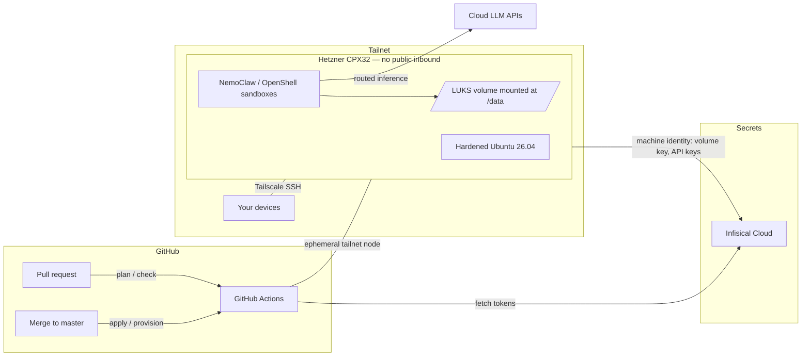

# Menegroth Server

Infrastructure-as-code for a single personal server that runs sandboxed AI agent
workflows. Everything about the server — infrastructure, provisioning,
secrets wiring, and the agent runtime — is defined in this repository.

## Stack

| Layer | Tool | Notes |
|-------|------|-------|
| Infrastructure | [Terraform](https://developer.hashicorp.com/terraform) + [hcloud provider](https://registry.terraform.io/providers/hetznercloud/hcloud) | Hetzner CPX32 (4 vCPU / 8 GB / 160 GB), state in HCP Terraform (state-only) |
| Provisioning | [Ansible](https://docs.ansible.com/) | Hardening, Tailscale, Infisical, LUKS volume, NemoClaw |
| Access | [Tailscale](https://tailscale.com/) | Fully dark host: **zero** public inbound ports |
| Secrets | [Infisical Cloud](https://infisical.com/) | Source of truth for all credentials |
| Agent runtime | [NVIDIA NemoClaw](https://github.com/NVIDIA/NemoClaw) | Agents in OpenShell sandboxes, routed inference |
| CI/CD | GitHub Actions | Terraform plan/apply and Ansible runs; runners join the tailnet |
| Pipeline security | [zizmor](https://zizmor.sh) + [CodeQL](https://codeql.github.com) | Workflow static analysis; SHA-pinned actions kept fresh by self-hosted [Renovate](https://docs.renovatebot.com) |

## Architecture


```mermaid
flowchart LR
    subgraph GitHub
        PR[Pull request] -->|plan / check| CI[GitHub Actions]
        M[Merge to master] -->|apply / provision| CI
    end
    subgraph Secrets
        INF[Infisical Cloud]
    end
    subgraph Tailnet
        DEV[Your devices] ---|Tailscale SSH| SRV
        CI ---|ephemeral tailnet node| SRV
        subgraph SRV[Hetzner CPX32 — no public inbound]
            HARD[Hardened Ubuntu 26.04]
            VOL[/LUKS volume mounted at /data/]
            NC[NemoClaw / OpenShell sandboxes]
            NC --> VOL
        end
    end
    CI -->|fetch tokens| INF
    SRV -->|machine identity: volume key, API keys| INF
    NC -->|routed inference| API[Cloud LLM APIs]
```

Key properties:

- **True full-disk encryption.** The root filesystem is LUKS2 (custom image
  built by the `packer/` pipeline; unencrypted `/boot` only) and the data
  volume is LUKS2. At boot the initramfs joins the tailnet as an ephemeral
  `tag:boot-unlock` node and a launchd agent on your Mac (`macos/`) delivers
  the passphrase from 1Password automatically, but only after verifying the
  boot node answers directly from the server's own public IP (a disk copy
  can't impersonate it). Reboots are hands-free while your Mac is awake; the
  Hetzner console is the manual fallback
  ([docs/troubleshooting.md](docs/troubleshooting.md)).
- **Dark host.** The Hetzner Cloud Firewall drops all inbound traffic. SSH and
  every service are reachable only over the tailnet (Tailscale requires no
  inbound ports). Break-glass access is the Hetzner web console — see
  [docs/runbooks/break-glass.md](docs/runbooks/break-glass.md).
- **Secrets never live in this repo or in GitHub, except three bootstrap
  credentials.** GitHub repo secrets hold only the Infisical machine-identity
  credentials (client ID + secret) and the HCP Terraform token; workflows pull everything else
  (Hetzner token, Tailscale OAuth client, ntfy topic) from Infisical at
  run time.
- **Key custody is split.** The data-volume key comes from Infisical (the
  server's own identity can read it); the root passphrase lives in a
  dedicated 1Password vault (service-account, read-only, that vault only)
  with a recovery copy under Infisical `/unlock` — a path the server
  identity can never read, so the server cannot unlock itself.
- **Agents are sandboxed.** NemoClaw runs each agent inside an OpenShell
  container with a blueprint controlling filesystem scope, network egress, and
  inference routing.

Full design rationale and the decision log live in
[docs/architecture.md](docs/architecture.md).

## Repository layout

```
terraform/            Hetzner infrastructure (server, firewall, volume, SSH key)
packer/               FDE image pipeline (LUKS2 root + tailnet-unlock initramfs)
ansible/              Provisioning: inventory, site.yml, roles/
macos/                Mac unlock agent (launchd + 1Password + ntfy)
scripts/bootstrap/    One-time bootstrap automation + preflight validator
.github/workflows/    terraform, ansible, packer, shellcheck, zizmor, codeql, renovate
scripts/ci/           CI helpers (template rendering + shellcheck)
docs/                 architecture.md, troubleshooting.md, verification.md, runbooks/
```

## One-time bootstrap

The bootstrap is scripted (`scripts/bootstrap/`). It has two parts: create a
small set of **seed credentials** by hand — the accounts/tokens that
*authenticate the automation*, so they can't be automated away — then run the
script, which generates and stores everything else (root/data LUKS keys, the
admin SSH key, the Tailscale ACL, the 1Password vault items) into
Infisical, 1Password, and GitHub. A condensed, tick-through version of the
steps below lives in
[docs/runbooks/bootstrap-checklist.md](docs/runbooks/bootstrap-checklist.md).

**Prerequisites:** install the CLIs the script drives — `op` (1Password),
`gh` (GitHub), `infisical`, plus `jq`, `curl`, `openssl`, and optionally
`hcloud` (preflight). Sign in to `gh` (`gh auth login`) and `infisical`
(`infisical login`). **Do not sign `op` in for the scripts** — project scripts
never use a personal 1Password session; they authenticate with vault-scoped
service-account tokens only (below), so 1Password itself enforces that the
project can touch the `Menegroth` vault and nothing else.

### 1. Seed credentials (create by hand)

| Service | Create | Becomes |
|---|---|---|
| **HCP Terraform** | org + workspace `menegroth`, execution mode **Local**; a user/team API token | `TF_API_TOKEN` (GitHub) |
| **Infisical** (EU, `eu.infisical.com`) | **two** projects (`menegroth` + a server project) + two universal-auth machine identities (below) | GitHub secrets + `/ci` |
| **Tailscale** | an **API access token**; then — *after* phase 20 pushes the ACL — three **OAuth clients**, each `auth_keys` scope + one tag: `tag:ci`, `tag:server`, `tag:boot-unlock`; and a fourth with `devices:core` scope (write) and tags `tag:server` + `tag:boot-unlock`, so CI can remove the image test's and an image roll's old tailnet nodes (D13) | `TS_API_TOKEN` (script); `TS_OAUTH_*`, `TS_SERVER_OAUTH_SECRET`, `TS_DEVICES_OAUTH_*` (→ `/ci`); `TS_BOOT_OAUTH_SECRET` (→ `/unlock`) |
| **Dead-man monitor** | a check at [healthchecks.io](https://healthchecks.io) (or any service that alerts when pings stop): period 15 min, grace ~45 min, alerting to your ntfy topic/phone | `HEARTBEAT_URL` (→ `/server`) |
| **Hetzner Cloud** | a **Read & Write** API token (project → Security → API Tokens) | `HCLOUD_TOKEN` (→ `/ci`) |
| **Anthropic** | an API key for NemoClaw's inference, linked to a service account, in a workspace with a spend limit, expiration **Never** (you rotate it) | `ANTHROPIC_API_KEY` (→ `/server`, stored by hand) |
| **1Password** | vault `Menegroth` + two vault-scoped service accounts (below) | `MENEGROTH_OP_BOOTSTRAP_TOKEN` (script); `MENEGROTH_OP_UNLOCK_TOKEN` (→ `macos/install.sh`) |
| **GitHub** | a **Renovate GitHub App** (Contents + Pull requests + **Workflows** + Issues + Commit statuses: write; Dependabot alerts: read) installed on this repo | `RENOVATE_APP_ID` / `RENOVATE_APP_PRIVATE_KEY` (→ `/ci`) |

**Why two projects:** path-scoped access control within one project is a paid
Infisical feature. On the free plan the access boundary is *project
membership*, so the split-custody rule (the `server` identity must never read
`/unlock`) is enforced structurally — `/server` lives in its own project. See
`docs/architecture.md` D8. Create:

- **`menegroth` project** (`prod` env) — holds `/ci` + `/unlock`. Note its
  Project ID → `INFISICAL_PROJECT_ID`. The workflows reference it by slug.
- **a server project** (any name, `prod` env) — holds `/server`. Note its
  Project ID → `INFISICAL_SERVER_PROJECT_ID` (and `ansible/group_vars/all.yml`).

The two Infisical identities are org-level objects (create each → give it
Universal Auth → add it as a member of **only** its project, with a built-in
**read** role):

- **`ci`** — member of the **`menegroth`** project only (reads `/ci` + `/unlock`;
  the Packer build reads `/unlock` as this identity). Its Client ID/Secret
  become the GitHub secrets `INFISICAL_CLIENT_ID` / `INFISICAL_CLIENT_SECRET`.
- **`server`** — member of the **server project only**; **never** added to
  `menegroth` (that membership is what would let it read `/unlock` and unlock
  its own root). Its Client ID/Secret go into `/ci/SERVER_IDENTITY_CLIENT_ID` /
  `_SECRET` (the script stores them), where the Ansible `infisical` role later
  delivers them onto the host.

The two 1Password **service accounts** confine the project to the `Menegroth`
vault — 1Password enforces the scope server-side, and service accounts can
never be granted your Private vault. Create them at 1password.com →
**Developer → Service Accounts** (or with your own `op` session — your only
personal-session act in this project):

- **`menegroth-bootstrap`** — grant **read & write items** on `Menegroth`
  **only**. Its token is the `MENEGROTH_OP_BOOTSTRAP_TOKEN` seed (creates/reads
  the vault items during bootstrap). **Revoke this account when the bootstrap
  is done** (step 4).
- **`menegroth-unlock`** — grant **read items** on `Menegroth` **only**. Its
  token is what `macos/install.sh` stores (0600, on disk so unlocks survive
  Mac reboots) for the Mac unlock agent — export it as
  `MENEGROTH_OP_UNLOCK_TOKEN` before running the installer, or paste it at
  the prompt.

```bash
# CLI alternative (run by YOU, once — tokens print once, copy them):
op service-account create menegroth-bootstrap --vault "Menegroth:read_items,write_items"
op service-account create menegroth-unlock   --vault "Menegroth:read_items"
```

The **Renovate GitHub App** keeps every dependency current (`renovate.yml`
runs it self-hosted). Create it at GitHub → **Settings → Developer settings →
GitHub Apps → New**, grant repository **Contents, Pull requests, Workflows,
Issues, Commit statuses: read & write** and **Dependabot alerts: read**
(Workflows write lets it update the SHA pins inside `.github/workflows/`;
Issues backs the Dependency Dashboard; Commit statuses carries the
`minimumReleaseAge` check), install it on this repo, and generate a private
key. `renovate.yml` requests exactly these when minting its token, so the App
must grant all of them. Its
**App ID** and **private key (PEM)** become the `/ci/RENOVATE_APP_*` secrets —
the workflow trades them for a short-lived token, so no Renovate PAT ever lives
in GitHub secrets.

**Why OAuth clients, not auth keys:** Tailscale auth keys expire after at most
90 days; the server and boot-node credentials are baked into the image, so an
expiring key would silently break reboots and rebuilds. OAuth client secrets
don't expire (`docs/architecture.md` D10). The scripts reject `tskey-auth-…`
values for those two seeds.

You do **not** create the ACL, the LUKS keys, the admin SSH key, or the
1Password items by hand — the script does all of that.

### 2. Configure and run

```bash
cd scripts/bootstrap
cp bootstrap.env.example bootstrap.env
$EDITOR bootstrap.env                 # set INFISICAL_PROJECT_ID + INFISICAL_SERVER_PROJECT_ID (+ overrides)

# Provide the seed secrets in your shell (see the SEEDS block in the .env):
export MENEGROTH_OP_BOOTSTRAP_TOKEN=...  # menegroth-bootstrap service account
export HCLOUD_TOKEN=... TS_API_TOKEN=...
export TF_API_TOKEN=... INFISICAL_CLIENT_ID=... INFISICAL_CLIENT_SECRET=...
export SERVER_IDENTITY_CLIENT_ID=... SERVER_IDENTITY_CLIENT_SECRET=...
export RENOVATE_APP_ID=... RENOVATE_APP_PRIVATE_KEY="$(cat renovate-app.pem)"

./bootstrap.sh --dry-run              # preview — touches nothing
./bootstrap.sh 10-onepassword 20-tailscale   # vault items + tailnet ACL (defines the tags)

# Now create the Tailscale OAuth clients (admin console → Settings →
# OAuth clients): three with auth_keys scope and one tag each, and one with
# devices:core scope (write) and tags tag:server + tag:boot-unlock:
export TS_OAUTH_CLIENT_ID=... TS_OAUTH_SECRET=...   # tag:ci
export TS_SERVER_OAUTH_SECRET=tskey-client-...       # tag:server
export TS_BOOT_OAUTH_SECRET=tskey-client-...         # tag:boot-unlock
export TS_DEVICES_OAUTH_CLIENT_ID=... TS_DEVICES_OAUTH_SECRET=tskey-client-...  # devices:core
export HEARTBEAT_URL=https://hc-ping.com/...         # dead-man monitor

./bootstrap.sh 30-infisical 40-github   # store everything (idempotent; safe to re-run)
```

The four phases (1Password → Tailscale → Infisical → GitHub) push the tailnet
ACL (and turn on MagicDNS), generate the LUKS and admin SSH keys, and store every secret at its
exact path/name — with all 1Password access running as the vault-scoped
`menegroth-bootstrap` service account. Then load the Mac unlock agent:

```bash
export MENEGROTH_OP_UNLOCK_TOKEN=...  # menegroth-unlock service account (or paste at the prompt)
cd ../../macos && ./install.sh        # stores the token 0600 for the agent
```

### 3. Preflight, then build

```bash
./preflight.sh                        # verifies every secret/name/ACL is present
```

Fix any `FAIL` lines, then dispatch the **Packer FDE image** workflow
(workflow_dispatch) from master. It builds the LUKS2-root snapshot, tests it
on a throwaway server (boot, the tailnet unlock path, unlock, kernel-update
survival), and labels it `fde=true` only if the test passes; Terraform
selects the newest `fde=true` snapshot on the next apply. A `WARN` that no
`fde=true` snapshot exists yet is expected until this build runs.

### 4. Revoke the bootstrap service account

Once the bootstrap is complete (preflight green, image built), revoke
**`menegroth-bootstrap`** at 1password.com → Developer → Service Accounts and
`unset MENEGROTH_OP_BOOTSTRAP_TOKEN`. The only standing 1Password credential is
then the read-only `menegroth-unlock` token on the Mac — re-create a bootstrap
account the same way if you ever re-run the vault phases.

> **The two public keys live in Infisical, not source.** `admin_ssh_public_key`
> and `mac_unlock_ssh_pubkey` are injected in CI as `TF_VAR_`/`PKR_VAR_` from
> `/ci/ADMIN_SSH_PUBLIC_KEY` and `/unlock/MAC_UNLOCK_SSH_PUBKEY`. For a **local**
> `terraform plan`, export `TF_VAR_admin_ssh_public_key` yourself (`validate`
> doesn't need it).

> **argv note.** The script passes seed tokens to `infisical`/`gh`/`curl` via
> their normal CLI arguments, so values are briefly visible in the process list
> on the machine you run it from. Fine for a personal one-time bootstrap; on a
> shared machine, rotate the seeds afterward.

## Personal dotfiles (optional)

The server's login account (`admin`; see below) can get **your own**
dotfiles, the way GitHub Codespaces does it: the `dotfiles` Ansible role
clones your repo at a pinned commit and runs the first of `install.sh`,
`install`, `bootstrap.sh`, `bootstrap`, `script/bootstrap`, `setup.sh`,
`setup`, `script/setup` it finds. Whatever that installer does (packages,
shell, tools) is your dotfiles' business; this repo carries no personal
configuration, so other operators get nothing, or their own.

Configure it with three GitHub **repository variables** (Settings → Secrets
and variables → Actions → Variables), or set them in `bootstrap.env` and let
bootstrap phase 40 create them:

| Variable | Value |
|---|---|
| `DOTFILES_REPO` | `https://` clone URL (public repo) |
| `DOTFILES_REF` | full 40-character commit SHA, never a branch |
| `DOTFILES_DEST` | optional clone path under `$HOME` (default `.dotfiles`; chezmoi users typically want `.local/share/chezmoi`) |

To roll out a newer commit, update the variable, then run the **Ansible**
workflow by hand (Actions → Ansible → Run workflow, on `master`):

```bash
gh variable set DOTFILES_REF --body "$(gh api repos/<you>/dotfiles/commits/master --jq .sha)"
```

**Trust:** the installer runs as `admin`, which has passwordless sudo, so your
dotfiles repo is effectively trusted with root on the server. That is why the
ref must be a commit SHA (a branch would hand root to whoever can push to it),
and why changes reach the server only when you bump `DOTFILES_REF`. The role
never overwrites local edits in the clone; it stops instead.

Day to day you log in as `admin` (`ssh admin@menegroth-server`, or set
`User admin` for the host in `~/.ssh/config`); manage agents with
`sudo -iu nemoclaw`. Its login shell is zsh (`admin_shell` in
`ansible/group_vars/all.yml`); your dotfiles supply the zsh configuration.

## Local development

Prereq: [uv](https://docs.astral.sh/uv/) — it manages all dev/CI Python
(Ansible + linters + pre-commit), pinned in `pyproject.toml` + `uv.lock` on the
latest stable Python (`.python-version`). uv installs the interpreter itself.

```bash
uv sync                       # installs the locked toolchain + pinned Python
uv run pre-commit install
cd terraform && terraform fmt -recursive && terraform validate
cd ../ansible && uv run ansible-lint
```

## Build phases

The repo was built incrementally; each phase is a self-contained commit that
leaves the system deployable:

0. Repo scaffolding (this README, docs, lint tooling)
1. Terraform foundation + CI (server reachable over temporary public SSH)
2. Ansible baseline hardening
3. Tailscale + go dark (all public inbound closed)
4. Infisical machine identity on the server
5. LUKS-encrypted data volume
6. NemoClaw agent runtime
7. Operations: backups, monitoring, runbooks
8. Packer pipeline for the FDE (LUKS2-root) server image
9. Server migrated to the FDE image
10. Mac unlock agent — automated remote unlock over Tailscale
11. Ops alignment: evening reboot window, stuck-at-boot alerting
12. Mac-side secrets moved from Apple Keychain to 1Password
13. Automated image test on a throwaway server; one-click image roll
